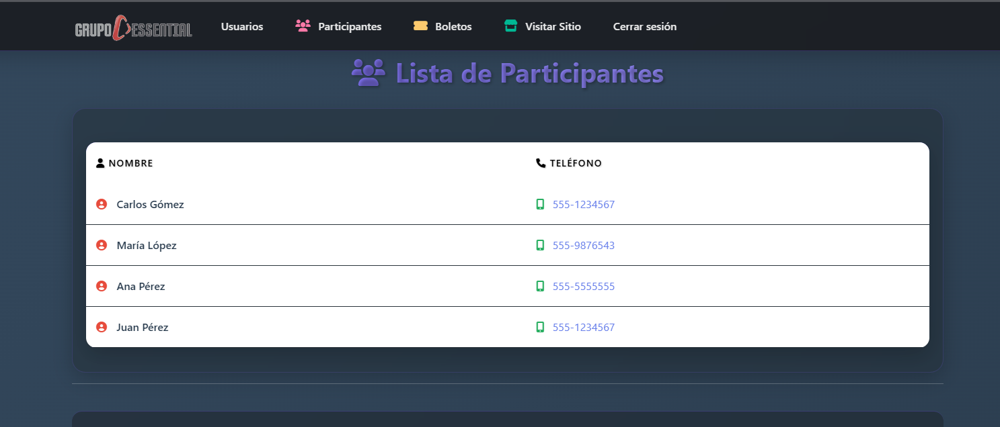
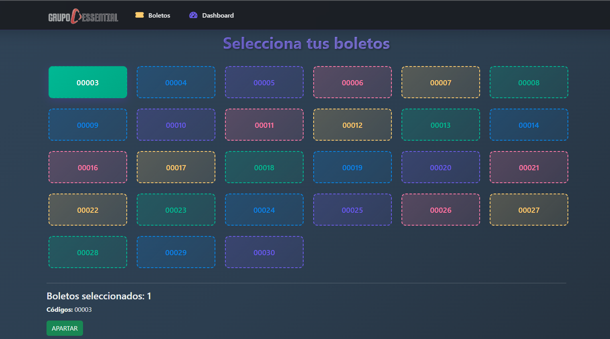

# Essential Pro Sorteo

Aplicación web fullstack en C# .NET para la gestión de sorteos digitales de ESSENTIAL PRO.

## Estructura
- backend/: API en .NET
- frontend/: MVC Web
- database.sql: Base de datos
- sp.sql: Procedimientos almacenados
- PostmanCollection.json: Para pruebas

## Cómo ejecutar
1. Restaurar paquetes NuGet: `dotnet restore`
2. Modificar la cadena de conexion con el nombre de su motor de Base de datos
2. Ejecutar la base de datos.
3. Ejecutar backend y frontend.

## Dashboard principal

## Reserva de boletos

